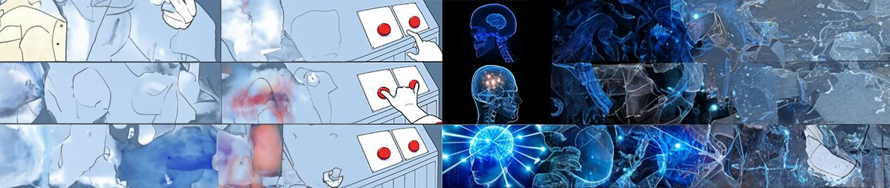

# »Interaction Design« Course @CoCo

_This repo documents the Interaction Design course for the [Code & Context](https://www.th-koeln.de/studium/code--context-bachelor_62103.php) Bachelor's program at [TH-Köln](https://www.th-koeln.de/) during the summer term of 2024._

  
View Course Description

The course "Interaction Design (DF22)" offers an in-depth examination of the principles and methodologies involved in shaping interactions with digital artifacts and processes. It encompasses the study of various interaction paradigms such as GUIs and TUIs, supplemented by an exploration of Interaction Design history and interface materiality. Through practical exercises and projects, participants engage in the experimentation of prototypes and Creative Coding techniques, while critically analyzing established methods within the field.

# Slides
- [🤗 Slide 1 – Welcome to Interaction Design](https://slides.cnrd.computer/iad-coco/1/)
- [📖 Slide 2 – The History of Interaction Design](https://slides.cnrd.computer/iad-coco/2/)
- [🔳 Slide 3 – The User and the Square World](https://slides.cnrd.computer/iad-coco/3/)
- [🖱️ Slide 4 – Naturalness || Conditioning](https://slides.cnrd.computer/iad-coco/3/)

# Exercises
- [Research Exercise: Interactive Insights](./exercises/Exercise%200:%20Evaluate%20Interactions.md)
- [Exercise I: Restricted Relations](./exercises/Exercise%20I:%20Restricted%20Relations.md)
- [Exercise II: Unusual Conditions](./exercises/Exercise%20II:%20Unusual%20Conditions.md)
- [Exercise III: Unusual Relations](./exercises/Exercise%20III:%20Unusual%20Relations.md)

# Timetable
02.04 Tuesday: Introduction & History of Interaction Design \
03.04 Wednesday: Self-learning day, Research Exercise \
04.04 Thursday: The User and the Square World, Exercise 1 \
05.04 Friday (only until 13:00 Uhr): Naturalness || Conditioning, Exercise 2

08.04 Monday: Exercise 2 \
09.04 Tuesday: Exercise 3 \
10.04 Wednesday: Self-learning day, Group work, Feedback  \
11.04 Thursday: Exercise 3 \
12.04 Friday: Presentations 

# Course Requirements and Evaluation

  
View Course Requirements and Evaluation

## Dokumentation
Die Dokumentation ist das Kernelement des Kursergebnisses. Sie sollte die Bearbeitung der drei 3 Teilaufgaben als Prozess darstellen. Besondere Wichtigkeit liegt auf den verschiedenen Iterationen und der Begründung von Entscheidungsfindungen. Warum wurden bestimmte Formen der Interaktion anderen Gegenüber bevorzugt? Was war das Spannende, was hat warum funktioniert? Das finale Ergebnis der selbstgewählten Interaktion sollte in der Dokumentation enthalten sein, jedoch nicht den Fokus der Dokumentation einnehmen. Die Darstellung und das Medium (PDF, (interaktive)Website, Videodokumentation, …) ist frei wählbar.

## Präsentation (approx. 15min)
Die Präsentation hat das Ziel, die selbstdefinierte Aufgabe darzustellen. Sie dient dazu, die Milestones des Prozesses darzustellen. Beantwortet auch hier die „Warum“-Fragen. Warum wurde sich für diese Form der Interaktion entschieden, welche Iterationen gab es, warum wurden bestimmte wieder verworfen? Was kam am Ende dabei raus und was ist an der gewählten Interaktion so spannend? Die Präsentation ist kein Pitch des Endergebnisses!

## Bewertung
60% Bewertung der Abgabe (Dokumentation)
- Ausführliche Dokumentation der Teilaufgaben
- Nachvollziehbarkeit des Prozesses und Begründbarkeit der getroffenen Entscheidungen, in allen 3 Teilaufgaben
- Qualität der Dokumentation (passend gewähltes Medium, Prozessdarstellungen, Fotos, Texte, …)

30% Bewertung der Präsentation (selbstdefinierte Aufgabe)
- Interativer Gestaltungsprozess (es wurden **verschiedene** Experimente durchgeführt)
- Begründbarkeit der getroffenen Entscheidungen
- Präsentationsweise
- Konzeptuelle und gestalterische Umsetzung der „selbstgewählten Interaktion“

10% Bewertung des Arbeitsprozess in Einzel & Gruppenarbeit
- Zwischenpräsentationen
- konstruktive Diskussionen

